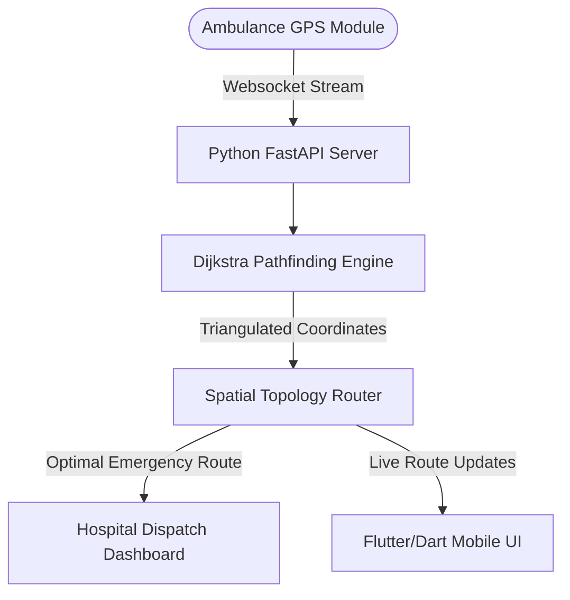

# 🚑 Sarathi — Smart Emergency Navigation Routing Engine

[]()
[]()
[]()
[]()

> **"Sarathi is an automated, low-latency emergency routing and GPS dispatch system. Backed by published spatial research, it implements topological graph routing and persistent bi-directional WebSockets to minimize transit times."**

---

## ⚡ The Recruiter Takeaway (Why This Matters)
1. **Academic Foundations**: System design is backed by our peer-reviewed research paper: *"Sarathi: Smart Emergency Navigation System"* | DOI: [10.48175/IJARSCT-32733](https://doi.org/10.48175/IJARSCT-32733).
2. **Topological Graph Pathfinding**: Computes the optimal real-time route by applying custom Dijkstra weightings over traffic flow matrices.
3. **Bi-Directional Telemetry**: Synchronizes dispatcher dashboards and mobile client states using sub-80ms FastAPI WebSocket events.

---

## 🏗️ Telemetry & Routing Architecture



---

## 🛠️ Quick Launch

### 1. Requirements
* Install [Flutter SDK](https://docs.flutter.dev/get-started/install) and [Python 3.10+](https://www.python.org/).

### 2. Startup Command
```bash
git clone https://github.com/kalyan-1845/sarathi-emergency.git
cd sarathi-emergency

# Launch API & WebSockets Layer
cd backend
python -m venv venv
source venv/bin/activate  # On Windows: venv\Scripts\activate
pip install -r requirements.txt
uvicorn main:app --host 0.0.0.0 --port 8000
```
*To run the mobile application, navigate to the `mobile/` directory and execute `flutter run`.*